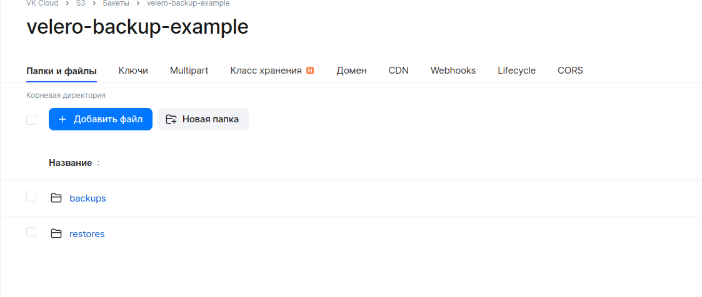

# k8s-velero-vkcloud-workshop

Сценарии работы с velero для бэкапирования и мигрирования нагрузки через велеро.

Полезные ссылки:
* [Установка velero](https://cloud.vk.com/docs/ru/base/k8s/install-tools/velero)
* [Резервное копирование через velero](https://cloud.vk.com/docs/ru/base/k8s/use-cases/velero-backup)
* [Смена параметров манифестов при восстановлении](https://velero.io/docs/main/restore-reference/#changing-poddeploymentstatefulsetdaemonsetreplicasetreplicationcontrollerjobcronjob-image-repositories)

# Установка velero в кластер

Вначале понадобится [клиент velero](https://github.com/vmware-tanzu/velero/releases), для управления.

Создадим бакет s3 для бэкапов velero.

Создаём файл s3_creds с данными ключа s3, у которого есть доступ к бакету:

```bash
[default]
aws_access_key_id=<идентификатор ключа (Access Key ID)>
aws_secret_access_key=<секрет (Secret Key)>
```

Устанавливаем velero в кластер, перед этим проверив доступ через kubectl:

```bash
velero install \
--plugins \
  velero/velero-plugin-for-aws:v1.8.2,registry.infra.mail.ru:5010/velero/velero-plugin-mcs:v1.2.2 \
--provider aws \
--bucket velero-backup-example \
--secret-file s3_creds \
--use-volume-snapshots=false \
--backup-location-config \
  region=ru-msk,s3ForcePathStyle="true",s3Url=https://hb.bizmrg.com:443
```

```shell
Velero is installed! ⛵ Use 'kubectl logs deployment/velero -n velero' to view the status.
```

Создаём секрет для доступа велеро к облаку (необходим для бэкапов PV):
```bash
kubectl -n velero create secret generic openstack-cloud-credentials \
  --from-literal OS_PROJECT_ID=$OS_PROJECT_ID \
  --from-literal OS_REGION_NAME=$OS_REGION_NAME \
  --from-literal OS_IDENTITY_API_VERSION=$OS_IDENTITY_API_VERSION \
  --from-literal OS_PASSWORD=$OS_PASSWORD \
  --from-literal OS_AUTH_URL=$OS_AUTH_URL \
  --from-literal OS_USERNAME=$OS_USERNAME \
  --from-literal OS_INTERFACE=$OS_INTERFACE \
  --from-literal OS_FILE_OPERATION_TIMEOUT=$OS_FILE_OPERATION_TIMEOUT \
  --from-literal OS_DOMAIN_NAME=$OS_USER_DOMAIN_NAME \
  -o yaml
```

Пропатчим деплоймент и укажем креды опенстека, для доступа велеро к апи облака (необходим для бэкапов PV):
```bash
kubectl patch deployment velero -n velero --patch-file velero-patch.yaml
```

Создаём локацию для снэпшотов (необходим для бэкапов PV):
```bash
velero snapshot-location create default --provider openstack --config region=ru-msk
```

После установки можно выполнить команду и проверить, что подключение к хранилищу бэкапов s3 прошло успешно:

```bash
velero backup-location get
```
```shell
NAME      PROVIDER   BUCKET/PREFIX   PHASE       LAST VALIDATED                  ACCESS MODE   DEFAULT
default   aws        ...             Available   ...                             ReadWrite     true
```

PHASE - должна быть Available.

Посмотреть файлы бэкапов можно в интерфейсе s3:


В случае любых проблем с
* установкой
* бэкапами 
* восстановлениями

самый эффективный источник информации по диагностике - логи пода велеро:
```bash
kubectl logs -n velero velero-<постфикс пода>
```

Чтобы получить список бэкапов:
```bash
velero backup get
```

Для этой и других команд velero можно использовать флаг --help для просмотра дополнительного функционала

```shell
NAME         STATUS      ERRORS   WARNINGS   CREATED                         EXPIRES   STORAGE LOCATION   SELECTOR
nginx-helm   Completed   0        0          2024-02-07 14:32:15 +0600 +06   29d       default            <none>
```

Удалить velero (будет удалено всё, кроме бакета s3, при последующих настройках можно использовать бакет):
```bash
velero uninstall
```

# Установка тестового приложения

Для тестового приложения установим аддон ingress nginx.

Устанавливаем приложение с диском, балансировщиком, деплойментом:

```bash
kubectl apply -f kube/test_app_ingress.yml
```

Получим айпи ингресс контроллера для отправки запросов
```bash
kubectl get svc -n ingress-nginx ingress-nginx-controller
```

# Бэкапирование вручную

Посмотреть список всех типов ресурсов в неймспейсе для указания списка ресурсов для бэкапа/восстановления

```bash
kubectl api-resources --verbs=list --namespaced -o name | xargs -n 1 kubectl get --ignore-not-found --show-kind -n example-app
```

Его далее нужно указать в параметре:

```bash
velero backup create <имя бэкапа> --include-resources=<ресурс1,ресурс2,...>
```

Выбираем пространство имён для бэкапа (можно выполнить бэкап нескольких неймспейсов в рамках одного бэкапа):

```bash
velero backup create hello-app-backup --include-namespaces example-app
```

Удаляем приложение:

```bash
kubectl delete -f kube/test_app_ingress.yml
```

Восстанавливаем приложение:

```bash
velero restore create --from-backup hello-app-backup
```

# Синхронизация/миграция между кластерами

В velero нету встроенных инструментов, поэтому можно использовать команду diff для формирования списка пространства имён, ресурсов и т.д.

Допустим мы хотим перенести из кластера 1 в кластер 2 некоторую дельту, например неймспейсы и ресурсы в них, и при этом запускать бэкап всего кластера 1 заново не хотим.

Для начала получим список пространств имён (также можно дополнительно отфильтровать его через grep):

```bash
kubectl get ns --no-headers | grep bx-bi-
```

для первого кластера получим:

cluster1.txt
```shell
bx-bi-1
bx-bi-2
bx-bi-3
```

cluster2.txt
```shell
bx-bi-2
bx-bi-4
bx-bi-5
```

Команда покажет неймспейсы, которых нет в первом кластере.
```bash
diff cluster2.txt cluster1.txt | grep '^>' | sed 's/^>\ //'
```
```shell
bx-bi-1
bx-bi-3
```

Далее можно выполнить бэкап на кластере 1:
```bash
velero backup create bi-users-diff --include-namespaces=bx-bi-1,bx-bi-3
```
И восстановление в кластер 2 (перед этим установив velero в кластер 2):
```bash
velero restore create bi-users-diff
```

Значения из этого списка можно указывать при восстановлении в кластер 2:

# Бэкапирование по расписанию

Velero позволяет настроить бэкапы по расписанию, используется формат расписания [cron](https://crontab.guru/every-1-minute).

```shell
┌───────────── минуты (0 - 59)
│ ┌───────────── часы (0 - 23)
│ │ ┌───────────── день месяца (1 - 31)
│ │ │ ┌───────────── месяц (1 - 12)
│ │ │ │ ┌───────────── день недели (0 - 6) (от Воскресенья до Субботы;
│ │ │ │ │                                   7 тоже воскресенье на некоторых системах)
│ │ │ │ │
│ │ │ │ │
* * * * *
```

Настроим бэкапирование раз в минуту:
```bash
velero schedule create hello-app-backup-minute --schedule="* * * * *" --namespace example-app --include-namespaces example-app
```

Получим список расписаний бэкапирования:
```bash
velero schedule get --namespace example-app hello-app-backup-minute
```
```shell
NAME                      STATUS   CREATED                         SCHEDULE    BACKUP TTL   LAST BACKUP   SELECTOR   PAUSED
hello-app-backup-minute   New      2024-02-07 15:35:32 +0600 +06   0 * * * *   0s           n/a           <none>     false
```

Получить описание созданного расписания:
```bash
velero schedule describe --namespace example-app hello-app-backup-minute
```
```shell
Name:         hello-app-backup-minute
Namespace:    example-app
Labels:       <none>
Annotations:  <none>

Phase:  New

Paused:  false
```

Создаваемые бэкапы будут иметь следующий формат имени:
```
<SCHEDULE NAME>-<TIMESTAMP>, где <TIMESTAMP> is formatted as ГодМесяцДеньЧасМинутыСекунды
```

Расписание можно проверить, запустив расписание вручную:
```bash
velero backup create --namespace example-app --from-schedule hello-app-backup-minute
```

Восстановление из расписания:
```bash
velero restore create --namespace example-app --from-schedule example-schedule
```

или по имени конкретный бэкап:

```bash
velero 
```


# Бэкапирование и управление helm

Развернём тестовое приложение через helm.

Добавим репозиторий чартов:
```bash
helm repo add bitnami https://charts.bitnami.com/bitnami
```

Поднимем релиз nginx, указав кастомное число реплик в файле values:
```bash
helm install nginx bitnami/nginx --values helm_app/nginx_values.yml
```

Проверим работоспособность, чарт создаёт балансировщик с внешним айпи для доступа к приложению:
```bash
kubectl get svc nginx
```

Извлекаем EXTERNAL-IP из вывода
```shell
NAME    TYPE           CLUSTER-IP      EXTERNAL-IP      PORT(S)        AGE
nginx   LoadBalancer   10.254.74.175   212.233.122.77   80:32657/TCP   13m
```

Отправляем тестовый запрос:
```bash
curl 212.233.122.77
```
```shell
<!DOCTYPE html>
<html>
<head>
<title>Welcome to nginx!</title>
...
```

Обновим чарт:
```bash
helm upgrade nginx bitnami/nginx --values helm_app/nginx_values.yml --set replicaCount=1
```

Для каждой ревизии будет создан secret в неймспейсе default:
```bash
kubectl get secret
```

```shell
NAME                          TYPE                 DATA   AGE
sh.helm.release.v1.nginx.v1   helm.sh/release.v1   1      13m
sh.helm.release.v1.nginx.v2   helm.sh/release.v1   1      10m
```

Посмотрим историю релиза через helm:
```bash
helm history nginx
```

```shell
REVISION        UPDATED                         STATUS          CHART           APP VERSION     DESCRIPTION     
1               Wed Feb  7 13:10:33 2024        superseded      nginx-15.10.3   1.25.3          Install complete
2               Wed Feb  7 13:14:05 2024        superseded      nginx-15.10.3   1.25.3          Upgrade complete
```

Выполним бэкап только секретов (версий) и развернём его в другом кластере:
```bash
velero backup create nginx-helm --include-resources secret --include-namespaces default
```

Удалим хэлм релиз:
```bash
helm uninstall nginx
```
```
release "nginx" uninstalled
```

Снова посмотрим историю релиза:
```bash
helm history nginx
```
```shell
release "nginx" uninstalled
```

Выполним восстановление из ранее созданного бэкапа:
```bash
velero restore create --from-backup nginx-helm
```
Так как мы не бэкапили ресурсы созданные helm, а только секреты с информацией о ревизиях релизов, необходимо выполнить rollback для поднятия ресурсов:

```bash
helm rollback nginx 1
```
```bash
Rollback was a success! Happy Helming!
```

Приложение восстановлено, проверим работоспособность:
```bash
kubectl get svc nginx
```

Извлекаем EXTERNAL-IP из вывода
```shell
NAME    TYPE           CLUSTER-IP      EXTERNAL-IP      PORT(S)        AGE
nginx   LoadBalancer   10.254.74.175   212.233.122.77   80:32657/TCP   13m
```

Отправляем тестовый запрос:
```bash
curl 212.233.122.77
```

# Восстановление в другой кластер

Для восстановления бэкапов, сделанных в кластере 1 в кластер 2, необходимо указать другой kubeconfig для доступа к кластеру, через переменную окружения KUBECONFIG.
Далее устанавливаем велеро на новый кластер, также как на исходный, обязательно указывая тот же бакет s3. Для переноса PV лучше переливать данные средствами приложений.

# Восстановление с заменой

В velero имеется возможность восстанавливать нагрузку и "на ходу" выставлять новые значения вроде класса PV или реджистри контейнеров у деплойментов, подов и тд.

Для выполнения операции необходимо создать configMap в кластере, где будет выполняться восстановление из бэкапа. Название может быть любое, velero использует labels для нахождения конфига.

```
kubectl apply -f velero-change-restore-cm.yml
```

Далее, как обычно, выполнеяем восстановление

```bash
velero restore create --from-backup 
```